# ☀️ Vidani Solar Panel Manager
### *Clean Energy Solutions - Field Operations Management System*

<br/>

<p align="center">
  
  
  
  
  
</p>

---

## 📲 Get the App

<table align="center">
  <tr>
    <td align="center">
      <a href="[YOUR_DRIVE_LINK_HERE]">
        
      </a>
      <br/><sub><b>Inspector Version</b></sub>
    </td>
    <td align="center">
      
      <br/><sub><b>Field Worker Version</b></sub>
    </td>
  </tr>
</table>

---

## 🎯 Project Overview

**Vidani Solar Panel Manager** is a comprehensive field operations management ecosystem designed for solar panel maintenance teams. The system provides role-specific applications with real-time hardware integration and efficient task management.

### 🏗️ **System Architecture**
```
┌─────────────────┐    ┌─────────────────┐    ┌─────────────────┐
│  Inspector App  │    │   Backend API   │    │  Hardware/IoT   │
│   (Flutter)     │◄──►│  (TypeScript)   │◄──►│ (MQTT Protocol) │
└─────────────────┘    └─────────────────┘    └─────────────────┘
         ▲                       ▲                       ▲
         │                       │                       │
         ▼                       ▼                       ▼
┌─────────────────┐    ┌─────────────────┐    ┌─────────────────┐
│   Cleaner App   │    │ MySQL Database  │    │ Real-time Data  │
│ (Coming Soon)   │    │   (Persistent)  │    │   Monitoring    │
└─────────────────┘    └─────────────────┘    └─────────────────┘
```

---

## 🛠️ Core Features

### 🔐 **Authentication & Role Management**
- **Multi-role Login System** with secure credential validation
- **Inspector Dashboard** with comprehensive navigation
- **Profile Management** with role-specific access controls

### 🎫 **Ticket Management System**
- **Real-time Ticket Tracking** with status updates
- **Priority-based Categorization** (Critical, High, Medium, Low)
- **Interactive Chat System** for ticket communication
- **Status Timeline** with detailed progress tracking

### 📅 **Advanced Scheduling**
- **Two-week Schedule Overview** with visual indicators
- **Automated Inspection Cycles** with time-slot management
- **Plant-specific Scheduling** integrated with hardware systems

### 🏭 **Plant Operations Dashboard**
- **Live System Health Monitoring** (Water, Pressure, RTC)
- **Plant Specifications** (Panels, Capacity, Area)
- **Real-time Status Updates** with visual indicators
- **Hardware Integration** via MQTT protocol

### 🤖 **Smart Automation Features**
- **Automatic Schedule** - Set-and-forget cleaning cycles
- **Manual Override** - On-demand cleaning operations
- **Time Slot Configuration** - Customizable maintenance windows
- **Activity History** - Complete operational logs

---

## 📱 Inspector App Interface

<div align="center">

| Authentication | Dashboard | Plant Details |
|:---:|:---:|:---:|
|  |  |  |
| **Secure Role-based Login** | **Inspection Overview** | **Real-time Monitoring** |

| Ticket System | Scheduling | Automation |
|:---:|:---:|:---:|
|  |  |  |
| **Advanced Ticket Management** | **Weekly Planning** | **Smart Control System** |

</div>

---

## ⚡ Technology Stack

<table>
<tr>
<td width="33%" align="center">

### **Frontend**
<br/>
**Cross-Platform Mobile Development**
- Material Design UI
- State Management
- Real-time Updates
- Offline Capability

</td>
<td width="33%" align="center">

### **Backend**
<br/>
**Scalable API Infrastructure**
- RESTful APIs
- Real-time WebSocket
- Authentication & Authorization
- Data Validation

</td>
<td width="33%" align="center">

### **IoT Integration**
<br/>
**Hardware Communication**
- Real-time Messaging
- Device Control
- Status Monitoring
- Automated Triggers

</td>
</tr>
</table>

---

## 🌟 Key Capabilities

### 👨‍🔧 **For Inspectors**
- **Comprehensive Dashboard** - Real-time overview of all operations
- **Ticket Management** - Full lifecycle from creation to resolution
- **Plant Monitoring** - Live hardware status and health metrics
- **Schedule Planning** - Two-week visibility with flexible management
- **Direct Communication** - Built-in chat system for field coordination

### 🏗️ **For Plant Operations**
- **Automated Cleaning Cycles** - Scheduled maintenance operations
- **Manual Override Controls** - Emergency and on-demand operations
- **Performance Monitoring** - Real-time system health tracking
- **Historical Analytics** - Complete operational history and logs
- **Hardware Integration** - Direct communication with solar panel systems

### 📊 **For Management**
- **Live Status Monitoring** - Real-time visibility across all plants
- **Performance Analytics** - Comprehensive operational metrics
- **Resource Optimization** - Efficient scheduling and task allocation
- **Quality Assurance** - Inspection tracking and compliance monitoring

---

## 🔄 Inspector Application Flow

```mermaid
flowchart TD
    A[🔐 Inspector Login] --> B[📊 Dashboard]
    B --> C[🎫 Ticket Management]
    B --> D[📅 Schedule View]
    B --> E[🏭 Plant Information]
    B --> F[👤 Profile]
    
    C --> C1[📋 View All Tickets]
    C --> C2[💬 Ticket Chat]
    C --> C3[🔄 Status Updates]
    
    D --> D1[📆 Two-week Schedule]
    D --> D2[⏰ Time Slots]
    D --> D3[📝 Schedule Notes]
    
    E --> E1[🚨 Raise Ticket]
    E --> E2[⚙️ Plant Controls]
    
    E2 --> E2A[🤖 Automatic Schedule]
    E2 --> E2B[👨‍💼 Manual Schedule]
    E2 --> E2C[⏰ Time Slot Config]
    E2 --> E2D[📜 Operation Logs]
    
    F --> F1[ℹ️ Profile Details]
    F --> F2[🚪 Logout]
```



---

## 🚀 Installation & Setup

### Prerequisites
```bash
Flutter SDK >= 3.0.0
Node.js >= 18.0.0
MySQL >= 8.0
MQTT Broker (Mosquitto recommended)
```

### Quick Start
```bash
# Clone the repository
git clonehttps://github.com/alonevaibhav/solar-master

# Frontend setup
cd vidani-solar-manager/inspector-app
flutter pub get
flutter run

## 📈 System Performance

| **Metric** | **Performance** | **Target** |
|:---|:---:|:---:|
| **Real-time Updates** | < 2 seconds | ✅ Achieved |
| **Ticket Response Time** | < 1 second | ✅ Achieved |
| **MQTT Message Delivery** | < 500ms | ✅ Achieved |
| **Mobile App Launch** | < 3 seconds | ✅ Achieved |
| **Database Query Speed** | < 100ms | ✅ Achieved |

---

## 🤝 Contributing

We welcome contributions from the community! Please check our [Contributing Guidelines](CONTRIBUTING.md) for detailed information.

### **Development Guidelines**
- Follow Flutter/Dart best practices
- Maintain TypeScript coding standards
- Write comprehensive unit tests
- Update documentation for new features
- Test MQTT integrations thoroughly

---

## 📞 Support & Documentation

<div align="center">

[](docs/README.md)
[](https://github.com/[username]/vidani-solar-manager/issues)
[](https://github.com/[username]/vidani-solar-manager/discussions)
[](mailto:support@vidani-solar.com)

</div>

---

## 📄 License

This project is licensed under the **MIT License** - see the [LICENSE](LICENSE) file for details.

---

<div align="center">

### 🌱 **Empowering Clean Energy Through Technology**

<sub>Built with ❤️ for sustainable energy solutions</sub>

<br/>

**⭐ Star this repository to support sustainable energy innovation! ⭐**

</div>